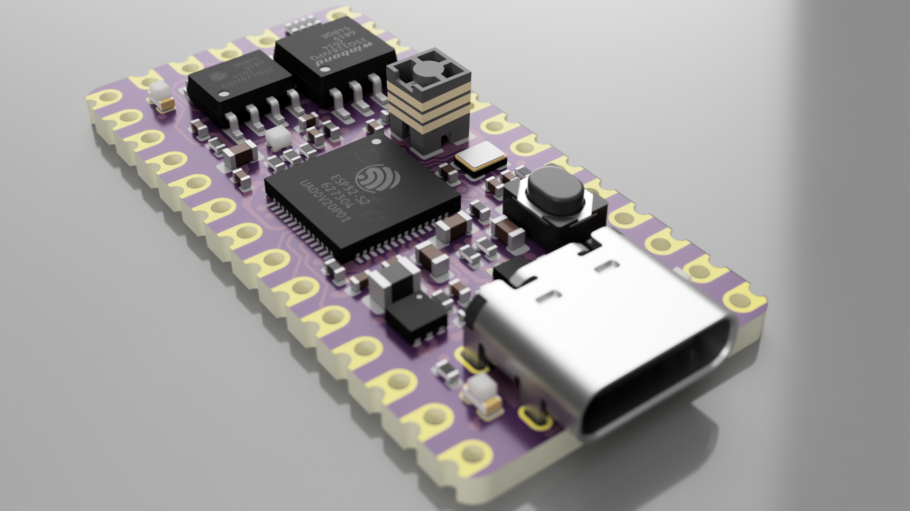

# Obsidian Boa #

     ~ Current Status: Early Design stage ~

A simple compact ESP32-S2 development board

Form-factor based off [bitsy-v1.0a](https://github.com/icebreaker-fpga/icebreaker/tree/master/hardware/bitsy-v1.0a)

## What is it?
ESP32-S2 + PSRAM + FLASH

## Licence
 * Hardware in this repository is licenced under Creative Commons BY-SA

 ## OSHW Certification
 TBD (Will apply when prototypes tested)